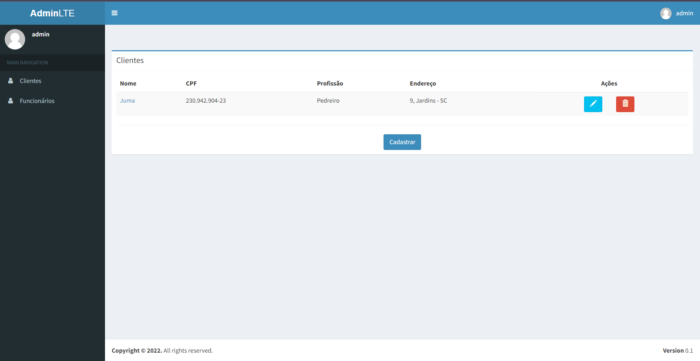
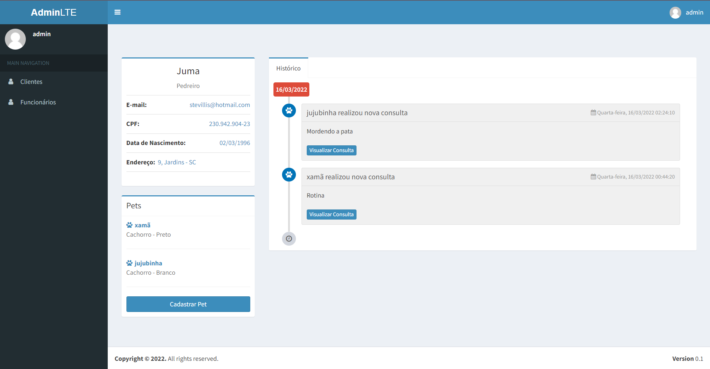
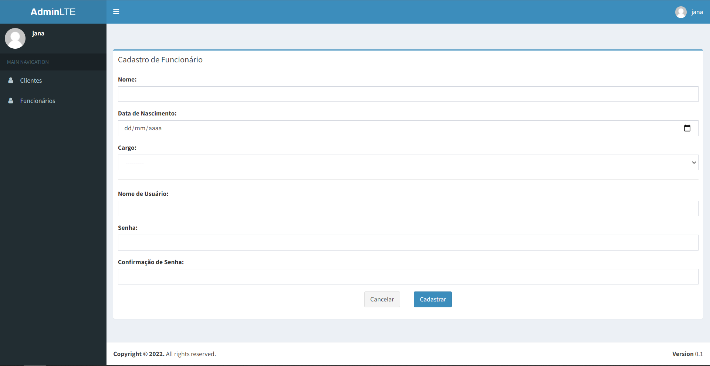
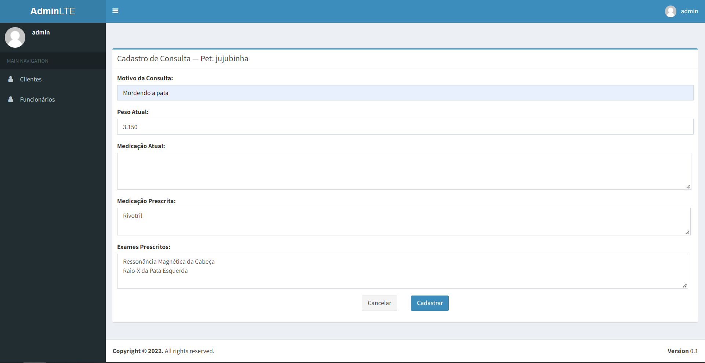
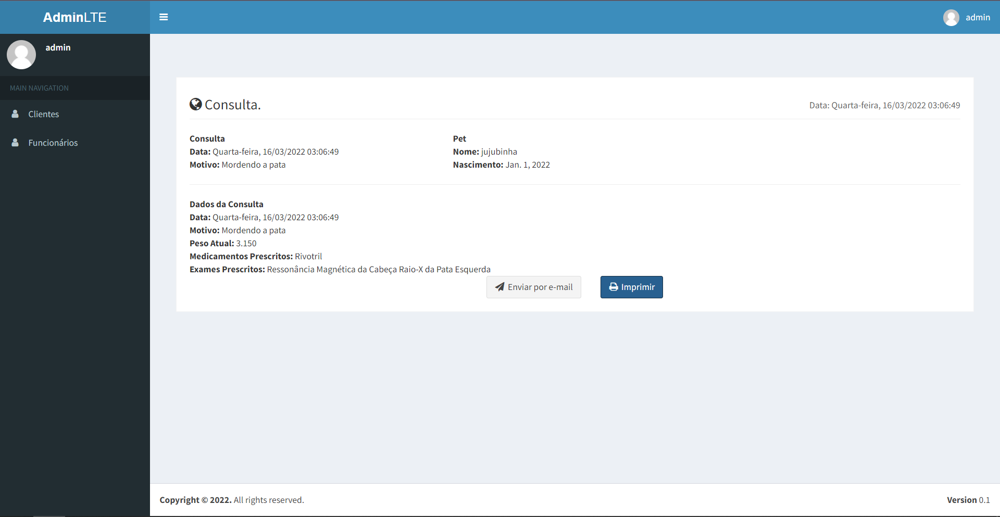

# Sistema de Gerenciamento de Clínica PET

### Funcionalidades

- #### Cadastros
    - Cadastro de Cliente (CRUD)
      
      &nbsp;
    - Cadastro de Pet (Inserção e Visualização)
      
      &nbsp;
    - Cadastro de Funcionário (Inserção e Visualização)
      
      &nbsp;

- #### Agendamento de Consulta para Pet
  

- #### Documentos
    - Exportar Dados de Consulta de um Pet para PDF
    - Envio das informações de Consulta de um Pet por E-mail

&nbsp;

- #### Autenticação
    - Login
    - Logout

- #### Autorização - Níveis de Acesso às funcionalidades de acordo com o Cargo do Usuário
    - Financeiro
        - Apenas usuários com este Cargo podem Cadastrar e Visualizar Funcionários
        - Apenas usuários com este Cargo podem Editar e Excluir dados de Clientes
    - Veterinário
        - Apenas usuários com este Cargo podem Cadastrar Consultas para Pets
    - Atendimento
        - Acessa todas as outras funcionalidades

--- 

### Tecnologias

- Back-end
    - Django
    - MySQL (Desenvolvimento)
    - PostgreSQL (Produção)
- Front-end
    - HTML
    - CSS
    - Bootstrap
    - jQuery Mask Plugin
    - Django AdminLTE 2
- Versionamento
    - Git
- Cloud
    - Heroku

---

### Live Demo (Clique na imagem)

###### Obs.: Como utilizo um servidor gratuito, pode demorar um pouco até o site abrir.

#### Usuários para teste

- Veterinário
    - Login: teste_veterinario
    - Senha: Mud@r123
- Financeiro
    - Login: teste_financeiro
    - Senha: Mud@r123